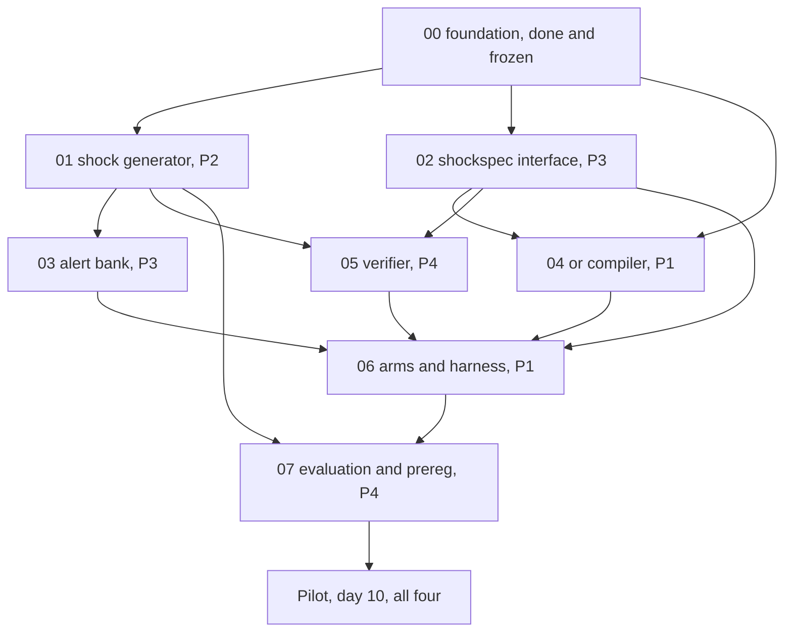

# COLLIE implementation plan — two-week build

This directory is the working brief for the team. One document per module, each with two
checkpoints. Read this file first, then your module document, then `00-foundation.md` for the
substrate you build on.

## The one-sentence goal

A selectively invoked frozen LLM commits to a typed exogenous shock hypothesis chosen from past
information only; a deterministic compiler maps that commitment into inventory-model inputs; a
future-only sequential test decides whether the commitment earns influence; a capped base-stock
controller computes every order.

> The LLM says what changed once. Statistics decides whether to trust it. OR decides what to do
> repeatedly.

Authoritative method detail lives in `init_design_docs/03_compile_shocks_or_always_inventory.md`
and `init_design_docs/03_5_compile_shocks_or_always_inventory.md`. The audited environment contract
is `docs/env_contract.md`. The statistical argument is `docs/derivation_note.md`. Do not contradict
any of the three without a dated entry in `prereg/deviations.md`.

## Scope of these two weeks

**In scope: the software build, ending with a green pilot and a recorded go/no-go decision.**

Out of scope, scheduled after: the full held-out test sweeps, the 1,300-episode null audit, the
robustness sweeps, the confirmatory statistics, artifact packaging, and the paper. Those are gated
on compute and on the pilot's verdict, not on engineering hours. Running confirmatory experiments
against code that has not been audited would forfeit the preregistration discipline the whole
design rests on.

The foundation is already on `main`: the pinned benchmark, the audited environment contract, the
frozen core contracts, the episode runner with proven accounting equivalence, arm 1, and the
derivation note. `00-foundation.md` describes what that gives you.

## Honest assessment of the timeline

This compresses about four weeks of originally planned work into two. Every module document
therefore separates **core** from **deferred**. Core is what Checkpoint 2 must deliver. Deferred
items are named explicitly and are the agreed cut line, not a surprise.

If a module is going to miss, say so at Checkpoint 1, not by silently dropping tests. A module that
arrives late with evidence is recoverable. A module that arrives on time with untested internals is
not, because everything downstream inherits the fault.

## Ownership and windows

| Module | Owner | Week 1 | Week 2 |
|---|---|---|---|
| `01-shock-generator.md` | P2 | demand + supply families | splits, seed registry, null bank |
| `02-shockspec-interface.md` | P3 | registry, schema, validators | prompt, extraction, repair |
| `03-alert-bank.md` | P3 | template bank | conditions, controls, rater audit |
| `04-or-compiler.md` | P1 | grid, mapping, controller | FIFO ledger, isolation proofs |
| `05-verifier.md` | P4 | demand e-processes | forward algorithm, lifecycle |
| `06-arms-and-harness.md` | P1, P2 on controls | triggers | LLM client, arms 3-7, controls |
| `07-evaluation-and-prereg.md` | P4 | preregistration | evaluation engine |

Two items are jointly owned and are the integration risk:

- **Arms 8, 9, 10**, the handshake itself — P1 + P4, days 8-9.
- **The pilot** — all four, day 10.

P3 carries two modules because the ShockSpec schema and the alert bank are one surface seen from
two sides: what the model reads, and what it must produce. Splitting them across two people would
put a translation boundary in the worst possible place.

## Dependency graph



Nothing here should block you on day 1. `collie/fakes/` exists precisely so every module develops
against a stand-in and converges late. Use the fake, write the integration test, let the real
dependency land when it lands. If you are waiting on someone, you have missed a fake.

## Checkpoint calendar

Ten working days. Day 1 is the first day of week 1. Staggered so no more than three audits land in
one day.

| Day | Checkpoint 1 audits | Checkpoint 2 audits |
|---|---|---|
| 3 | `01` shock generator, `02` shockspec interface | |
| 4 | `04` or compiler, `05` verifier | |
| 5 | `03` alert bank, `06` arms, `07` prereg | |
| 8 | | `01` shock generator, `03` alert bank |
| 9 | | `02` shockspec interface, `04` or compiler, `05` verifier |
| 10 | | `06` arms, `07` evaluation and pilot |

A checkpoint is **not** "code complete". It is a demoable, testable slice with a single command an
auditor can run in under five minutes and a result they can judge.

## Audit protocol

When you hit a checkpoint, stop and request an audit. Do not start the next checkpoint's work until
you have a verdict.

**What you submit.** This, nothing more:

```
Module:      NN-name, Checkpoint N
Command:     <the exact command from the checkpoint section>
Result:      <pasted output, trimmed to the summary lines>
Built:       <=5 bullets, what now works
Deviations:  <anything done differently from the document, and why>
Blocked on:  <nothing, or the specific thing>
```

**What the auditor does.** Runs the command, reads the diff, spends at most fifteen minutes, and
returns one of:

- **Pass** — proceed.
- **Pass with notes** — proceed, fix the notes inside the next checkpoint.
- **Rework** — the checkpoint is not met. Nothing downstream starts. Fix and resubmit.

**What earns a rework, every time.** Not style opinions; each one silently invalidates results:

1. A test that asserts nothing, or that would pass against a stub.
2. Hidden ground truth reachable from a policy, verifier, trigger, compiler, or prompt.
3. A number hard-coded where the environment contract or the preregistration is the source.
4. A confirmatory-looking output that is not in the preregistration.
5. An untested error path on anything that parses model output.

## Standing rules

Checked at both checkpoints, every module.

1. **Hidden state is unreachable.** No policy, controller, verifier, trigger, prompt builder, or
   compiler may read `HiddenIncident`, `HiddenAlertSpec`, `SupplyRealization`, latent parameters,
   future demand, benchmark pattern names, instance or article ids, or test labels. The oracle arm
   is the single exception and is never tuned on test. Enforced by
   `collie.contracts.assert_no_hidden_state` at runtime and by AST tests statically.
2. **Count every call.** Attempted, format-repaired, rejected, unusable, cached, input and output
   tokens, latency, dated cost, for every arm, including calls charged to counterfactual arms that
   shared one physical request.
3. **No method change after the method freeze** without a dated entry in `prereg/deviations.md`.
4. **No test-set result** may influence sample size, thresholds, compiler mappings, or arm
   selection.
5. **Label every analysis** `confirmatory` or `exploratory` in the output record itself, not only in
   prose.
6. **The benchmark submodule is read-only.** Only `collie/adapter/` may reach it, by import or by
   path. Both are enforced.
7. **Read parameters from the contract.** `docs/env_contract.md` and the manifests are the source
   for horizon, ordering, cost structure, and the cap. Never a literal in module code.

## Claim discipline

The paper claims only the bounded LLM-to-environment-model-to-OR handshake in which an adaptively
selected typed shock hypothesis is frozen before prospective evidence can authorise its influence on
repeated inventory decisions. The activation guarantee is **model-conditional, anytime-valid,
per-episode**.

It is not dataset-wide family-wise control, not a safety guarantee, not a profit guarantee, and it
does not cover wrong-family activation.

Never claim: a first event-triggered LLM, first persistent agent memory, first falsifiable
commitment, first LLM-to-OR interface, a statistically certified inventory agent, a safe controller,
or a first online LLM-generated inventory policy.

## Commands

```bash
make setup              # submodule, LFS, environment
make test               # full suite with coverage
make test-fast          # skips slow, benchmark, LLM, equivalence markers
make lint               # ruff check + format check
make equivalence        # accounting equivalence vs the official pipeline
make arm1               # arm 1 over all 1,320 instances, both harnesses
make check-freeze       # frozen contracts have not drifted
make gate1              # every foundation condition, one command
```

## Open blockers

Two things are unresolved, and under this schedule both land in week 1 rather than week 4. They are
repeated in `06-arms-and-harness.md`, the module that stops without them.

1. **Local LLM serving.** Which open-weight model, and is an OpenAI-compatible endpoint already
   running on the 4x RTX 4090 + RTX A6000 box? vLLM is assumed but unconfirmed.
2. **Hosted API key.** The preregistered confirmation subset needs a hosted model. Which provider,
   and is a key available?

Until both are answered, `06` builds against `collie/fakes/fake_llm.py` and its Checkpoint 1 is
unaffected. Checkpoint 2 is blocked.
